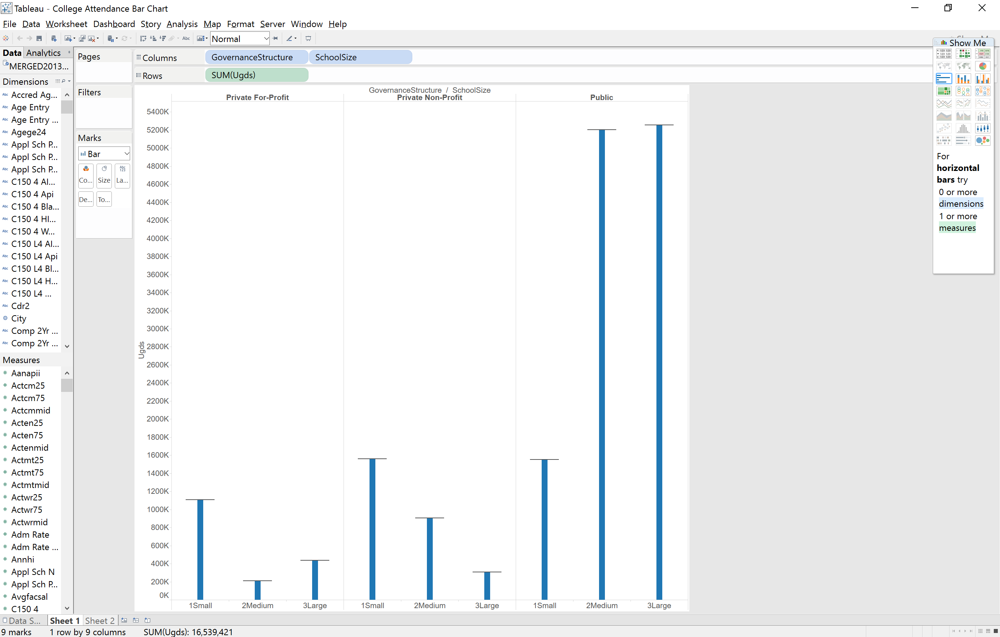
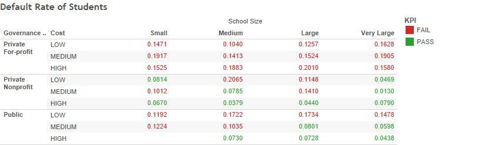

In this project, analysed a very large set of U.S. College Data. Every one of the over 7000 U.S. Colleges are represented, including private, public, and for profit universities, some with tens of thousands of undergraduates, and some with under a dozen. The data set had over 1300 columns, measuring factors like SAT scores, acceptance rates, cost, completion rates, and more.

For reference, the code for our Shiny app can be found in ui.R and server.R, and the completed project can be found at https://danielschlomer.shinyapps.io/FinalProject


Here is the source code for our shiny app:

```{r}
source("../04 Shiny/server.R",echo=TRUE)
```

```{r}
source("../04 Shiny/ui.R",echo=TRUE)
```

***

In total, the data show that there are 7804 different universities in the United States. This seems high. One way to get a feel for what kinds of colleges there are in the U.S. is to categorize them by size. To do this, we created a histogram of colleges, with bins based on the number of undergraduates.


The Shiny implementation of this graph can be found under the histogram tab.

As you can see, the vast majority of these 7000 colleges are small. It turns out that there are thousands of colleges with fewer than 1000 students.

***

But where are students actually attending college? From the graph above, it might look like students are overwhelmingly favoring small colleges. However, the previous graph is "misleading" because it gives equal weight to "Dance Theatre of Harlem Inc," with 11 undergraduates, and Ohio State, with over 43,000 undergraduates.

What we want is to create our own categories (Small, Medium, and Large) and sum up the total number of students attending each kind of school there. The final result in Tableau looks like this:



The Shiny implementation of this graph can be found under the barchart tab.

***

We were also interested in another facet included in this data - percentage of "First Generation" college students at each college. A first generation student is a student who is the first in their family to attend college. We thought it would be interesting to compare this data with a college's retention rate - that is, the percentage of students who return after their first semester. Are first generation students inspired to work harder, and are more likely to return after a semester? Or do they struggle more than other students? This question can be answered with data.

Here is what the visualization looks like in Tableau:


The Shiny implementation of this graph can be found under the scatterplot tab.

As you can see, colleges with more first generation students have a lower rate of retention.

***

What else might affect retention rates? Our colleges are broken up in to categories: Public (e.g. UT), Private Non-Profit (e.g. Rice), and Private For-Profit (e.g. ITT Technical Institute). Do these different categories have different retention rates? We created a boxplot in Tableau to find out.


The Shiny implementation of this graph can be found under the boxplot tab.

As you can see, Private For-Profit colleges have by far the worst retention rates.

***

Finally, we looked at these categories again, and further broke them down by the size of the college. One measure of a college's quality is the rate of default - that is, the percentage of people who are unable to repay their college loans 3 years after graduation. We created a crosstab to look at this data.



By running a SQL query, we can see a list of colleges in each of the above categories. We saved this query in 02Data/SchoolBreakdown.r 

By running the query, we can see that low cost public universities include Community Colleges, such as  

In the high cost, private, very large category, there is only one college - Liberty University. Our data shows that they have over 40,000 students, which most likely includes online students.

The Shiny implementation of this graph can be found under the crosstab tab.

We also implemented an adjustable KPI - the user can set a cutoff point for default rates, above wich a grouping of colleges "fails."
